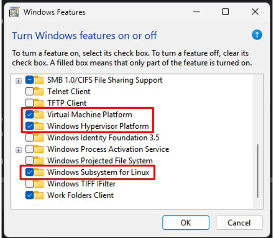

# COMP 433 Project Files

We require that the command `nvidia-smi` works, if using a NVIDIA GPU.

We also require ~50GB of available storage space to be safe.

The user should clone this repository first. (if in Windows 11, please clone it in WSL2 and do everything in there)

```
git clone https://github.com/chengharv-pen/comp433_braintotext.git
```

From here, we will assume that Python is installed.

# Downloading Data

Assuming that the user is located at project root, run
```
python download_data.py
```

If this does not work for some reason, then download it manually from <a href="https://datadryad.org/dataset/doi:10.5061/dryad.dncjsxm85">Dryad</a>, place it in the `./data` directory and unzip the zip files in the same directory.

# Docker

We provide a Docker container to make it easier to run the code.

- If the user is on Windows 11, please install Docker Desktop and start Docker Desktop. If there are issues starting Docker Desktop, make sure that these Windows Features are enabled and restart the computer.

- If the user is on Linux, please install the package `docker.io`.

Then run this command
```
docker pull chengharvp/comp433-b2txt25-test
```

Change shm-size if you have a lot more RAM. 12g signifies 12GB RAM.

```
docker run -it --rm --gpus all \
  --privileged \
  --shm-size=12g \
  -p 8888:8888 \
  -v ./:/workspace/comp433_braintotext25 \
  chengharvp/comp433-b2txt25-test:latest
```
From here, we will assume that the Docker container is running. To exit the container, use the `logout` command.

# Running a Jupyter Notebook within Docker

Whenever this command is executed

```
jupyter notebook --ip=0.0.0.0 --port=8888 --no-browser --allow-root
```

### Linux:
Click the bottom link that is formatted as such:
```
http://<ip_address>:8888/tree?token=<token>
```

### Windows:
Copy the token in the bottom link
```
http://<ip_address>:8888/tree?token=<token>
```

Then navigate to `http://localhost:8888/` and paste the `<token>` to access Jupyter.

# Training a Model

If hyperparameters need to be modified, please change the contents of `<model_type>_args.yaml`.

In `./project_files/<model_type>`, you can run

```
python train_model.py
```

If this does not work, it should be because the `<model_folder>` exists in `trained_models`. In this case, modify these arguments in `<model_type>_args.yaml`

```
output_dir: trained_models/<model_folder> # directory to save the trained model and logs
checkpoint_dir: trained_models/<model_folder>/checkpoint # directory to save checkpoints during training
```

# Evaluation and Validation

The <a href="https://drive.google.com/drive/folders/1GCUhWd1V7r5I-W7cfLoYWKNOVCWrxW_5">Google Drive</a>'s folders are structured as `<model_type>/<model_folder(s)>`

You can download a model folder from there, and place it in `./project_files/<model_type>/trained_models/<model_folder>`. The zip file needs to be extracted in place.

Specifically for `<model_folder>`, you need to modify a file name since Google Drive downloads it as a zip. In `<model_folder>/checkpoint/`, rename `best_checkpoint.zip` to `best_checkpoint`.

```
mv best_checkpoint.zip best_checkpoint
```

For this project, we restricted ourselves to only using the 1-gram decoder, since we do not have enough RAM to run the 3-gram (~60GB RAM) and the 5-gram (~300GB RAM) decoders.
```
cd comp433_braintotext25/language_model/runtime/server/x86
conda activate b2txt25_lm
python setup.py install

cd ../../../../
sysctl vm.overcommit_memory=1
redis-server --daemonize yes
```
WARNING: THE FOLLOWING COMMAND MAY NOT WORK, DEPENDING ON YOUR SYSTEM'S RAM/VRAM.

If there is not enough RAM/VRAM in your system, please modify the `model_name` parameter in the `build_opt()` method, located at `./language_model/language-model-standalone.py` [line 96]. This parameter is meant to define the OPT model to pull from Hugging Face.
- Facebook's OPT 125m is the default OPT model for this project.
- Facebook's OPT 6.7b requires a GPU with at least ~12.4 GB of VRAM to load for inference.
```
python language_model/language-model-standalone.py --lm_path language_model/pretrained_language_models/openwebtext_1gram_lm_sil --do_opt --nbest 100 --acoustic_scale 0.325 --blank_penalty 90 --alpha 0.55 --redis_ip localhost --gpu_number 0 &
```
Before running evaluation
```
cd project_files/<model_type>
conda activate b2txt25
```
Evaluating on the validation set, to get the Word Error Rate metric
```
python evaluate_model.py --model_path trained_models/<model_folder> --data_dir ../../data/hdf5_data_final --eval_type val --gpu_number 0
```
Evaluating on the test set (Kaggle submissions)
```
python evaluate_model.py --model_path trained_models/<model_folder> --data_dir ../../data/hdf5_data_final --eval_type test --gpu_number 0
```
